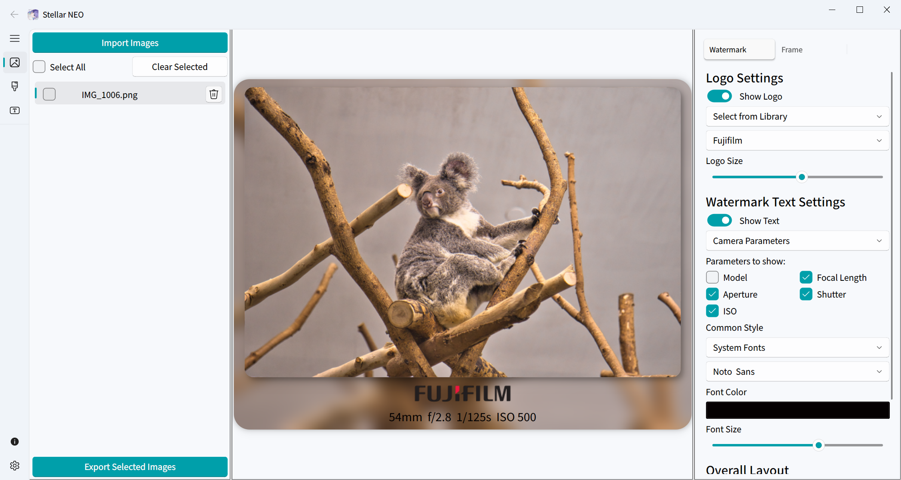

<!-- Language Switcher -->

<div align="right">

[繁體中文](README_zh-TW.md) | [简体中文](README_zh-CN.md)

</div>

<!-- Header -->

<div align="center">

<!-- TODO: Replace with your actual logo path -->


Stellar Neo

A modern, elegant, and powerful photo framing and watermarking tool.

<!-- Shields/Badges -->

<p>
<a href="https://www.python.org/"></a>
<a href="https://riverbankcomputing.com/software/pyqt/"></a>
<a href="https://www.google.com/search?q=LICENSE"></a>
<br/>


</p>

</div>
✨ Introduction

Have you ever been frustrated by the lack of satisfactory watermarking applications, especially when they fail to read the precious EXIF data from photos edited with tools like LRC or Luminar Neo? This frustration was the driving force behind the creation of Stellar Neo.

Stellar Neo is a desktop application meticulously crafted for photographers and creators. Our primary goal is to provide a truly "out-of-the-box," detail-oriented, and completely free solution for photo framing and watermarking.

<!--
TODO: Place a screenshot of the main application interface.
This image should display the overall layout: image list, preview area, and control panel.
-->

<p align="center">

</p>
🚀 Key Features

Intelligent EXIF Recognition: Automatically reads camera model, lens, ISO, aperture, and other parameters upon import, and intelligently matches the corresponding brand logo.

- Powerful Watermark System:

  - Logo Watermark: Supports auto-detection, selection from a built-in brand library, or uploading and managing your own logos.

  - Text Watermark: Display camera parameters or custom text with full control over font, size, and color.

  - High Customization: Freely adjust the relative position of the logo and text (vertical, horizontal) and precisely place the watermark in nine positions within the frame or on the photo.

- Flexible Frame Editing:

  - Versatile Frame Styles: Choose between a solid color background or a blurred extension of the photo content.

  - Fine-tuned Padding Control: Independently adjust the top, bottom, and side padding of the frame to create the perfect proportions.

  - Visual Enhancements: Add rounded corners and shadows to both the photo and the frame for a polished look.

- Efficient Batch Processing:

  - Supports batch import of images via drag-and-drop or a button click.

  - One-click "Select All / Deselect All" for easy list management.

  - A clear progress bar is displayed during export, with status indicators for completed items.

- Personalized Asset Libraries:

  - Built-in managers for logos and fonts, allowing you to upload, preview, and use your own assets.

- Modern User Interface:

  - A clean and beautiful interface inspired by VS Code.

  - Supports three theme modes: Light, Dark, and System.

  - Multi-language support (Traditional Chinese, Simplified Chinese, English, etc.).

  - Adjustable layout to fit various screen sizes.

<!--
TODO: Place a GIF demonstrating core features.
For example: dragging and dropping images, adjusting watermarks, switching frame styles.
-->
<!--
<p align="center">


</p>
-->
🛠️ Installation & Usage

```bash
# Clone the repository:

git clone https://github.com/HuangNO1/Stellar-Neo.git
cd Stellar-Neo

# Install dependencies:
# It's recommended to use a virtual environment.

# Create a virtual environment (optional)
python -m venv venv
source venv/bin/activate  # For Windows: venv\Scripts\activate

# Install requirements
pip install -r requirements.txt

# Run the application:

python main.py
```

📦 Tech Stack

- UI Framework: PyQt6

- UI Components: PyQt-Fluent-Widgets

- EXIF Parsing: ExifRead / piexif

👤 About the Author

Moon Cancer

Let's go to the pier and grab some fries. Ciallo～(∠・ω< )⌒☆

- GitHub: [HuangNO1](https://github.com/HuangNO1)

- Blog: [Rem Blog](https://huangno1.github.io/)

🙏 Acknowledgements

- Application Logo Source: [「私」](https://www.pixiv.net/artworks/117867484) by [ｻｻﾞﾅﾐ。](https://www.pixiv.net/users/16252763).

📜 Disclaimer

All brand logos involved in this application are for academic and demonstration purposes only. Commercial use is strictly prohibited.
📄 License

This project is licensed under the MIT License.