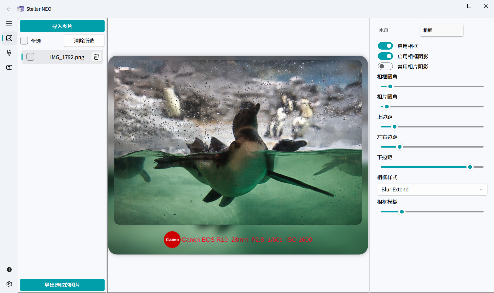

<!-- Language Switcher -->

<div align="right">

[English](README.md) | [繁體中文](README_zh-TW.md)

</div>

<!-- Header -->

<div align="center">

<!-- TODO: 请将路径替换为您的 Logo -->


Stellar Neo

一个现代、优雅且功能强大的照片边框与水印工具。

<!-- Shields/Badges -->

<p>
<a href="https://www.python.org/"></a>
<a href="https://riverbankcomputing.com/software/pyqt/"></a>
<a href="LICENSE"></a>
<br/>


</p>

</div>
✨ 项目简介

您是否也曾因为市面上缺乏满意的照片水印应用而感到困扰？特别是当辛苦拍摄、通过 LRC 或 Luminar Neo 编辑后的照片，其宝贵的 EXIF 信息却无法被正确读取时，那种失落感促使了 Stellar Neo 的诞生。

Stellar Neo 是一款为摄影爱好者与创作者精心打造的桌面应用程序。我的初衷是提供一个真正“开箱即用”、专注于细节优化、且完全免费的相框与水印解决方案。

<!--
TODO: 放置应用程序主界面的屏幕截图
这张图应该能展示应用的整体布局：图片列表、预览区、控制区。
-->

<p align="center">

</p>
🚀 主要功能

- 智能 EXIF 识别：导入图片后自动读取相机型号、镜头、ISO、光圈等参数，并智能匹配对应的品牌 Logo。
- 强大的水印系统：
  - Logo 水印：支持自动检测、从内置品牌库选取，或上传并管理您自己的 Logo。
  - 文字水印：可显示相机参数或自定义文字，并完全控制字体、大小与颜色。
  - 高度自定义：自由调整 Logo 与文字的相对位置（上下、平行），并将水印精准定位在相框或照片内的九个位置。
- 灵活的相框编辑：
  - 多样化相框：可选择纯色背景或以照片内容延伸的模糊背景。
  - 精细边距控制：独立调整相框的上、下、左右边距，创造完美比例。
  - 视觉效果：为照片和相框添加圆角与阴影，提升质感。
- 高效的批量处理：
  - 支持拖拽或点击按钮批量导入图片。
  - 一键全选／取消全选，轻松管理图片列表。
  - 导出时提供清晰的进度条，并在完成后标记状态。
- 个性化资源库：
  - 内置 Logo 与字体管理器，让您上传、预览并使用自己的素材。
- 现代化用户界面：
  - 参考 VS Code 设计风格，界面简洁美观。
  - 支持浅色、深色、跟随系统三种主题模式。
  - 支持多国语言切换（繁中、简中、英文等）。
  - 可调式界面布局，适应不同屏幕大小。

<!--
TODO: 放置一个 GIF 动画来展示核心功能
例如：拖拽图片、调整水印、切换相框样式等操作。
-->
<!--
<p align="center">
  
</p>
-->
🛠️ 安装与运行

```bash
# 克隆项目：

git clone https://github.com/HuangNO1/Stellar-Neo.git
cd Stellar-Neo

# 安装依赖：
# 建议在虚拟环境中执行。

# 创建虚拟环境 (可选)
python -m venv venv
source venv/bin/activate  # Windows: venv\Scripts\activate

# 安装依赖
pip install -r requirements.txt

# 运行应用：

python main.py
```

📦 主要技术栈

- UI 框架: PyQt6

- UI 组件库: PyQt-Fluent-Widgets
    
- EXIF 读取: ExifRead / piexif

👤 关于作者

Moon Cancer

Let's go to the pier and grab some fries. Ciallo～(∠・ω< )⌒☆

- GitHub: [HuangNO1](https://github.com/HuangNO1)

- 博客: [Rem Blog](https://huangno1.github.io/)

🙏 致谢

- 应用程序 Logo 来源：[「私」](https://www.pixiv.net/artworks/117867484) by [ｻｻﾞﾅﾐ。](https://www.pixiv.net/users/16252763)。

📜 声明

本应用程序中涉及的所有品牌 Logo 仅用于学术交流与功能展示，严禁任何商业用途。

📄 许可证

本项目采用 MIT License 许可。