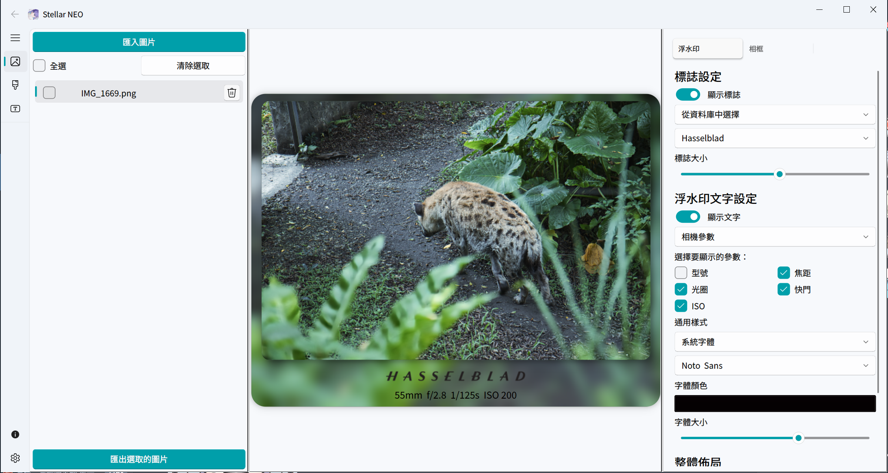

<!-- Language Switcher -->

<div align="right">

[English](README.md) | [简体中文](README_zh-CN.md)

</div>

<!-- Header -->

<div align="center">

<!-- TODO: 請將路徑替換為您的 Logo -->


Stellar Neo

一個現代、優雅且功能強大的相片邊框與浮水印工具。

<!-- Shields/Badges -->

<p>
<a href="https://www.python.org/"></a>
<a href="https://riverbankcomputing.com/software/pyqt/"></a>
<a href="LICENSE"></a>
<br/>


</p>

</div>
✨ 專案簡介

您是否也曾因為市面上缺乏滿意的浮水印應用而感到困擾？特別是當辛苦拍攝、透過 LRC 或 Luminar Neo 編修後的相片，其寶貴的 EXIF 資訊卻無法被正確讀取時，那種失落感促使了 Stellar Neo 的誕生。

Stellar Neo 是一款為攝影愛好者與創作者精心打造的桌面應用程式。我的初衷是提供一個真正「開箱即用」、專注於細節優化、且完全免費的相框與浮水印解決方案。

<!--
TODO: 放置應用程式主介面的螢幕截圖
這張圖應該能展示應用的整體佈局：圖片列表、預覽區、控制區。
-->

<p align="center">

</p>
🚀 主要功能

- 智慧 EXIF 辨識：匯入圖片後自動讀取相機型號、鏡頭、ISO、光圈等參數，並智慧匹配對應的品牌 Logo。

- 強大的浮水印系統：
  - Logo 浮水印：支援自動偵測、從內建品牌庫選取，或上傳並管理您自己的 Logo。

  - 文字浮水印：可顯示相機參數或自訂文字，並完全控制字體、大小與顏色。

  - 高度自訂：自由調整 Logo 與文字的相對位置（上下、平行），並將浮水印精準定位在相框或相片內的六個位置。

- 靈活的相框編輯：
  - 多樣式相框：可選擇純色背景或以相片內容延伸的模糊背景。
  - 精細邊距控制：獨立調整相框的上、下、左右邊距，創造完美比例。
  - 視覺效果：為相片和相框添加圓角與陰影，提升質感。

- 高效率的批次處理：

  - 支援拖曳或點擊按鈕批量匯入圖片。

  - 一鍵全選／取消全選，輕鬆管理圖片列表。

  - 匯出時提供清晰的進度條，並在完成後標示狀態。

- 個人化資源庫：

  - 內建 Logo 與字體管理器，讓您上傳、預覽並使用自己的素材。

- 現代化使用者介面：

  - 參考 VS Code 設計風格，介面簡潔美觀。

  - 支援淺色、深色、跟隨系統三種主題模式。

  - 支援多國語言切換（繁中、簡中、英文等）。

  - 可調式介面佈局，適應不同螢幕大小。

<!--
TODO: 放置一個 GIF 動畫來展示核心功能
例如：拖曳圖片、調整浮水印、切換相框樣式等操作。
-->
<!--

<p align="center">


</p>
-->
## 💻 下載與安裝

對於普通使用者，我們建議直接從以下位置下載最新發行的版本：

➡️ [**點此前往 GitHub Releases 頁面下載最新版本**](https://github.com/HuangNO1/stellar-neo/releases)

下載符合您作業系統（Windows / macOS）的安裝檔後，即可直接安裝使用，無需自行配置 Python 環境。

---

🛠️ 從原始碼執行 (開發者)

```bash
# 複製專案：

git clone https://github.com/HuangNO1/Stellar-Neo.git
cd Stellar-Neo

# 安裝依賴套件：
# 建議在虛擬環境中執行。

# 建立虛擬環境 (可選)
python -m venv venv
source venv/bin/activate  # Windows: venv\Scripts\activate

# 安裝依賴
pip install -r requirements.txt

# 執行應用：

python main.py
```

📦 主要依賴技術

- UI 框架: PyQt6
  
- UI 元件庫: PyQt-Fluent-Widgets
  
- EXIF 讀取: ExifRead / piexif

👤 關於作者

Moon Cancer

Let's go to the pier and grab some fries. Ciallo～(∠・ω< )⌒☆

- GitHub: [HuangNO1](https://github.com/HuangNO1)

- Blog: [Rem Blog](https://huangno1.github.io/)

🙏 致謝

- 應用程式 Logo 來源：[「私」](https://www.pixiv.net/artworks/117867484) by [ｻｻﾞﾅﾐ。](https://www.pixiv.net/users/16252763)。

📜 聲明

本應用程式中涉及的所有品牌 Logo 僅用於學術交流與功能展示，嚴禁任何商業用途。

📄 授權條款

本專案採用 MIT License 授權。